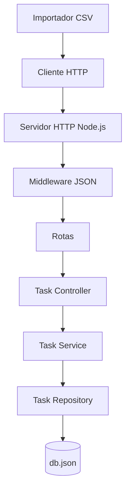
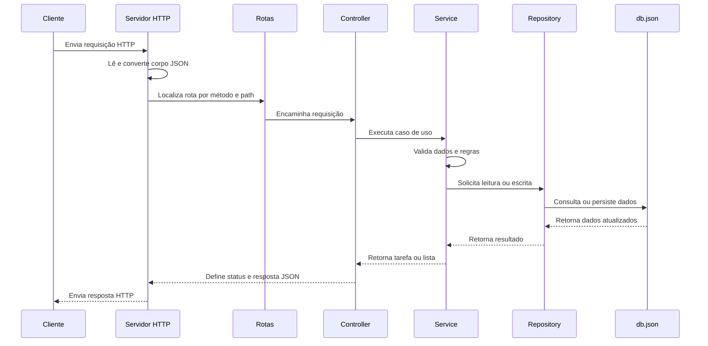

# Simple API in Node.js

## Descrição

API REST simples para gerenciamento de tarefas, construída com Node.js puro, sem frameworks HTTP externos. O projeto demonstra conceitos fundamentais de APIs, como roteamento, leitura de corpo JSON, parâmetros de rota, query params, tratamento de erros, separação em camadas e persistência local em arquivo JSON.

Esta aplicação é indicada para estudos de fundamentos de Node.js, prática de criação de APIs REST e entendimento de uma arquitetura simples organizada em controller, service, repository e database.

## Funcionalidades

- Criação de tarefas com título e descrição.
- Listagem de tarefas cadastradas.
- Busca de tarefas por termo no título ou na descrição.
- Atualização de título e descrição de uma tarefa.
- Marcação e desmarcação de tarefa como concluída.
- Remoção de tarefas.
- Persistência local dos dados no arquivo `db.json`.
- Importação de tarefas a partir de arquivo CSV.
- Tratamento padronizado para erros de validação e tarefas não encontradas.

## Tecnologias utilizadas

- Node.js
- JavaScript com ES Modules
- Módulo nativo `node:http`
- Módulo nativo `node:fs/promises`
- Módulo nativo `node:crypto`
- `csv-parse`
- npm
- JSON como armazenamento local

## Arquitetura

A aplicação segue uma arquitetura em camadas simples. O servidor HTTP recebe as requisições, aplica o middleware de JSON, localiza a rota correspondente e encaminha a chamada para o controller. O controller delega as regras de negócio para o service, que valida os dados e interage com o repository. O repository centraliza o acesso ao banco local baseado em arquivo JSON.



## Documentação da API

A API é executada por padrão em:

```txt
http://localhost:3333
```

O recurso principal da aplicação é `tasks`.

### Modelo de tarefa

```json
{
  "id": "78632fff-9795-4f51-9714-2c0d9b66f36d",
  "title": "Estudar Node.js",
  "description": "Revisar criação de APIs com HTTP nativo",
  "completed_at": null,
  "created_at": "2026-06-17T14:02:49.290Z",
  "updated_at": "2026-06-17T14:02:49.290Z"
}
```

### `GET /tasks`

Lista todas as tarefas cadastradas.

#### Parâmetros

| Nome | Tipo | Obrigatório | Descrição |
| --- | --- | --- | --- |
| `searchTerm` | string | Não | Termo usado para buscar tarefas pelo `title` ou pela `description`. |

#### Exemplo de requisição

```http
GET /tasks HTTP/1.1
Host: localhost:3333
```

#### Exemplo de resposta

```json
[
  {
    "id": "78632fff-9795-4f51-9714-2c0d9b66f36d",
    "title": "Estudar Node.js",
    "description": "Revisar criação de APIs com HTTP nativo",
    "completed_at": null,
    "created_at": "2026-06-17T14:02:49.290Z",
    "updated_at": "2026-06-17T14:02:49.290Z"
  }
]
```

### `GET /tasks?searchTerm=Node`

Busca tarefas cujo título ou descrição contenha o termo informado.

#### Exemplo de requisição

```http
GET /tasks?searchTerm=Node HTTP/1.1
Host: localhost:3333
```

#### Exemplo de resposta

```json
[
  {
    "id": "78632fff-9795-4f51-9714-2c0d9b66f36d",
    "title": "Estudar Node.js",
    "description": "Revisar criação de APIs com HTTP nativo",
    "completed_at": null,
    "created_at": "2026-06-17T14:02:49.290Z",
    "updated_at": "2026-06-17T14:02:49.290Z"
  }
]
```

### `POST /tasks`

Cria uma nova tarefa.

#### Corpo da requisição

| Campo | Tipo | Obrigatório | Descrição |
| --- | --- | --- | --- |
| `title` | string | Sim | Título da tarefa. |
| `description` | string | Sim | Descrição da tarefa. |

#### Exemplo de requisição

```http
POST /tasks HTTP/1.1
Host: localhost:3333
Content-Type: application/json

{
  "title": "Criar documentação",
  "description": "Escrever o README do projeto"
}
```

#### Exemplo de resposta

```json
{
  "id": "2f0f7d61-8c4f-4f3f-a62d-8de87d0d36b9",
  "title": "Criar documentação",
  "description": "Escrever o README do projeto",
  "completed_at": null,
  "created_at": "2026-06-17T14:20:00.000Z",
  "updated_at": "2026-06-17T14:20:00.000Z"
}
```

### `PUT /tasks/:id`

Atualiza o título e a descrição de uma tarefa existente.

#### Parâmetros

| Nome | Tipo | Obrigatório | Descrição |
| --- | --- | --- | --- |
| `id` | string | Sim | Identificador único da tarefa. |

#### Corpo da requisição

| Campo | Tipo | Obrigatório | Descrição |
| --- | --- | --- | --- |
| `title` | string | Sim | Novo título da tarefa. |
| `description` | string | Sim | Nova descrição da tarefa. |

#### Exemplo de requisição

```http
PUT /tasks/2f0f7d61-8c4f-4f3f-a62d-8de87d0d36b9 HTTP/1.1
Host: localhost:3333
Content-Type: application/json

{
  "title": "Atualizar documentação",
  "description": "Adicionar exemplos de uso da API"
}
```

#### Exemplo de resposta

```json
{
  "id": "2f0f7d61-8c4f-4f3f-a62d-8de87d0d36b9",
  "title": "Atualizar documentação",
  "description": "Adicionar exemplos de uso da API",
  "completed_at": null,
  "created_at": "2026-06-17T14:20:00.000Z",
  "updated_at": "2026-06-17T14:25:00.000Z"
}
```

### `PATCH /tasks/:id/complete`

Alterna o status de conclusão de uma tarefa. Caso `completed_at` esteja `null`, a tarefa será marcada como concluída. Caso já exista uma data em `completed_at`, a tarefa será marcada como não concluída.

#### Parâmetros

| Nome | Tipo | Obrigatório | Descrição |
| --- | --- | --- | --- |
| `id` | string | Sim | Identificador único da tarefa. |

#### Exemplo de requisição

```http
PATCH /tasks/2f0f7d61-8c4f-4f3f-a62d-8de87d0d36b9/complete HTTP/1.1
Host: localhost:3333
```

#### Exemplo de resposta

```json
{
  "id": "2f0f7d61-8c4f-4f3f-a62d-8de87d0d36b9",
  "title": "Atualizar documentação",
  "description": "Adicionar exemplos de uso da API",
  "completed_at": "2026-06-17T14:30:00.000Z",
  "created_at": "2026-06-17T14:20:00.000Z",
  "updated_at": "2026-06-17T14:30:00.000Z"
}
```

### `DELETE /tasks/:id`

Remove uma tarefa existente.

#### Parâmetros

| Nome | Tipo | Obrigatório | Descrição |
| --- | --- | --- | --- |
| `id` | string | Sim | Identificador único da tarefa. |

#### Exemplo de requisição

```http
DELETE /tasks/2f0f7d61-8c4f-4f3f-a62d-8de87d0d36b9 HTTP/1.1
Host: localhost:3333
```

#### Exemplo de resposta

```json
{
  "id": "2f0f7d61-8c4f-4f3f-a62d-8de87d0d36b9",
  "title": "Atualizar documentação",
  "description": "Adicionar exemplos de uso da API",
  "completed_at": "2026-06-17T14:30:00.000Z",
  "created_at": "2026-06-17T14:20:00.000Z",
  "updated_at": "2026-06-17T14:30:00.000Z"
}
```

### Respostas de erro

Quando os campos obrigatórios não são enviados ou possuem tipo inválido, a API retorna erro `400`.

```json
{
  "name": "ValidationError",
  "message": "O campo 'title' é obrigatório.",
  "status_code": 400
}
```

Quando uma tarefa não é encontrada, a API retorna erro `404`.

```json
{
  "name": "NotFoundError",
  "message": "Tarefa não encontrada.",
  "status_code": 404
}
```

## Fluxo da API



## Como executar o projeto localmente

### Pré-requisitos

- Node.js 18 ou superior
- npm
- Git

### Instalação

```bash
git clone [URL_DO_REPOSITÓRIO]
cd simple-api-in-nodejs
npm install
```

### Configuração das variáveis de ambiente

Atualmente o projeto não depende de variáveis de ambiente. A porta da API está definida diretamente em `src/server.js` como `3333`, e os dados são persistidos no arquivo local `db.json`.

Caso o projeto evolua para usar variáveis de ambiente, um arquivo `.env` poderá seguir este formato:

```env
API_PORT=3333
DATABASE_PATH=./db.json
```

### Executando o projeto

```bash
npm run dev
```

Após iniciar o servidor, a API estará disponível em:

```txt
http://localhost:3333
```

### Importando tarefas via CSV

O projeto inclui um script para importar tarefas de um arquivo CSV. O arquivo precisa conter as colunas `title` e `description`.

Exemplo de CSV:

```csv
title,description
Task 01,Task Description 01
Task 02,Task Description 02
```

Com a API em execução, rode:

```bash
npm run import-csv
```

Também é possível informar outro arquivo manualmente:

```bash
node import-csv.js caminho/para/tasks.csv
```

## Estrutura de pastas

```txt
.
├── src
│   ├── controllers
│   │   └── task-controller.js
│   ├── errors
│   │   └── index.js
│   ├── middlewares
│   │   ├── json.js
│   │   └── with-error-handler.js
│   ├── repositories
│   │   └── task-repository.js
│   ├── services
│   │   └── task-service.js
│   ├── utils
│   │   ├── build-route-path.js
│   │   ├── extract-query-params.js
│   │   └── validate-task-body.js
│   ├── database.js
│   ├── routes.js
│   └── server.js
├── data.csv
├── db.json
├── import-csv.js
├── package.json
├── package-lock.json
└── README.md
```

### Principais arquivos

- `src/server.js`: cria o servidor HTTP, aplica middlewares e direciona requisições para as rotas.
- `src/routes.js`: define os endpoints disponíveis na API.
- `src/controllers/task-controller.js`: recebe as requisições e monta as respostas HTTP.
- `src/services/task-service.js`: concentra as regras de negócio das tarefas.
- `src/repositories/task-repository.js`: centraliza o acesso aos dados de tarefas.
- `src/database.js`: implementa a persistência em arquivo JSON.
- `import-csv.js`: importa tarefas de um arquivo CSV usando a API.
- `db.json`: arquivo local usado como banco de dados.

## Exemplos de uso

### Criar uma tarefa

```bash
curl -X POST http://localhost:3333/tasks \
  -H "Content-Type: application/json" \
  -d '{
    "title": "Estudar fundamentos de Node.js",
    "description": "Praticar criação de API usando o módulo http"
  }'
```

### Listar tarefas

```bash
curl http://localhost:3333/tasks
```

### Buscar tarefas

```bash
curl "http://localhost:3333/tasks?searchTerm=Node"
```

### Atualizar uma tarefa

```bash
curl -X PUT http://localhost:3333/tasks/ID_DA_TAREFA \
  -H "Content-Type: application/json" \
  -d '{
    "title": "Estudar Node.js avançado",
    "description": "Revisar rotas, streams e persistência local"
  }'
```

### Marcar ou desmarcar uma tarefa como concluída

```bash
curl -X PATCH http://localhost:3333/tasks/ID_DA_TAREFA/complete
```

### Remover uma tarefa

```bash
curl -X DELETE http://localhost:3333/tasks/ID_DA_TAREFA
```
